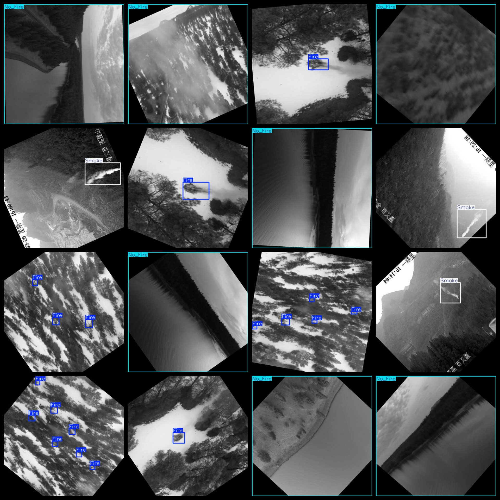
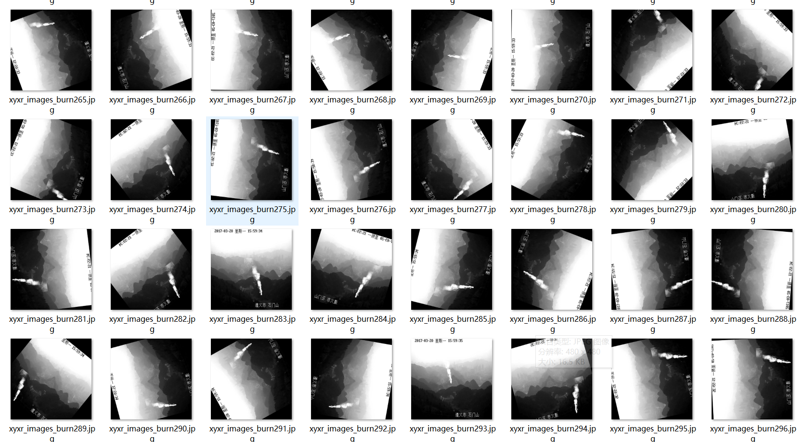

# UAV View Mountain Lin Smoke and Fire Detection Dataset 13521 imagesVOC+YOLO（(Augmented) ）

UAV Perspective Mountain Fireworks Detection Dataset 13521 VOCs + YOLOs (Enhanced)

Dataset Format: VOC format + YOLO format

The compressed file contains: three folders, each storing images, xml files, and text files.

Total jpg images in JPEGImages folder: 13521

The total number of XML files in the Annotations folder: 13521.

The total number of txt files in the labels folder is 13521.

Number of tag types: 3

Tag names: ["Fire","No_Fire","Smoke"]

The number of boxes for each label (Note that the order of labels in the Yolo format does not correspond to this, but is based on the classes.txt file in the labels folder):

Fire frame count = 10158

No_Fire frame count = 4581

Smoke frame count = 4939

Total boxes: 19678

Picture clarity (Resolution: Pixels): Clear

Images augmented: Yes

GitHub Repository Location: datasets_sl

Shape of the label: Rectangular box, used for object detection and recognition.

Important Note: None

Special Notice: This dataset does not guarantee the accuracy or precision of the trained models or weight files. The dataset only provides accurate and reasonable annotations.

Annotation and image details are as follows:

## Images

---

Here is a pay link on Stripe (https://buy.stripe.com/3cs8yP7sY87d0vu9AB). Please contact me lonlonago@foxmail.com after funding $89, and I will send you a complete data files, thank you!

